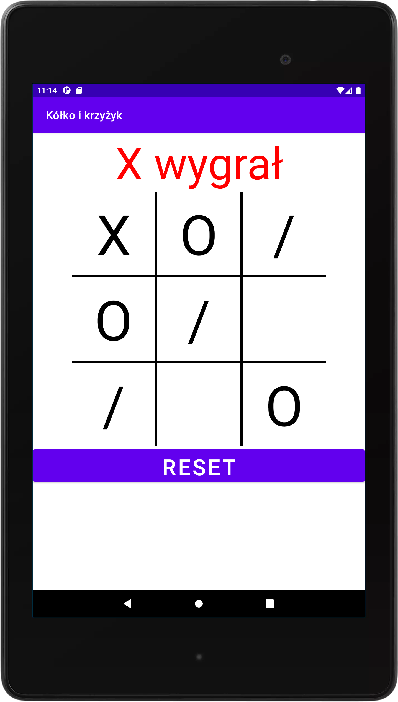

# Kółko i krzyżyk
Gra polega na ułożeniu trzech iksów w linii pionowej, poziomej lub na skos. 
Tworzona w środowisku programistycznym Android Studio i testowana pod urządzeniem o rozdzielczości 1200x1920. 

